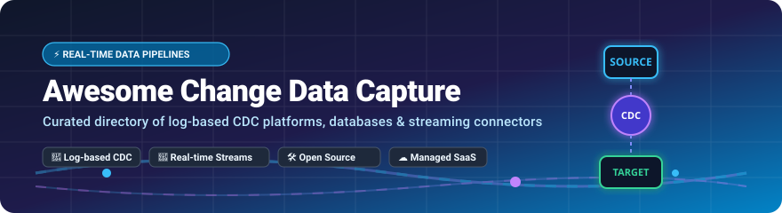

<!-- SEO Keywords: Change Data Capture, CDC, Log-Based CDC, Real-Time Data Replication, Database Streaming, Debezium, Kafka Connect, Postgres CDC, MySQL Binlog, Fivetran, Airbyte, Data Pipelines, Real-Time Analytics -->



<p align="center">
  <a href="https://github.com/ishandutta2007/Awesome-Awesome-Awesome"></a>
  <a href="https://discord.gg/jc4xtF58Ve"></a>
  <a href="https://github.com/ishandutta2007/Awesome-Change-Data-Capture-Platform/stargazers"></a>
  <a href="https://github.com/ishandutta2007/Awesome-Change-Data-Capture-Platform/network/members"></a>
  <a href="https://github.com/ishandutta2007/Awesome-Change-Data-Capture-Platform/blob/main/LICENSE"></a>
  <a href="https://github.com/ishandutta2007/Awesome-Change-Data-Capture-Platform/pulls"></a>
  <a href="https://github.com/ishandutta2007"></a>
</p>

# ⚡ Awesome Change Data Capture (CDC) Platforms & Ecosystem 🚀

> **A curated directory of top SaaS products and open-source GitHub projects for Change Data Capture (CDC), real-time database replication, log-based event streaming, and enterprise data pipelines.**

---

## 📖 Introduction to Change Data Capture (CDC)

**Change Data Capture (CDC)** tracks row-level modifications (`INSERT`, `UPDATE`, `DELETE`) made to source databases (such as PostgreSQL, MySQL, MongoDB, Oracle, and SQL Server) in near real-time. By reading transaction logs directly—without incurring performance overhead on primary workloads—CDC platforms stream continuous change events into message brokers (e.g., Apache Kafka, Apache Pulsar, AWS Kinesis) and analytical data warehouses (Snowflake, BigQuery, ClickHouse, Databricks).

### Key CDC Use Cases:
* 🔄 **Real-Time Data Warehousing & Lakehouses**: Continuous ETL/ELT pipelines with sub-second data propagation.
* 🏗️ **Microservices Synchronization**: Outbox pattern implementation and event-driven architectures.
* ⚡ **Real-Time Cache Invalidation & Search Indexing**: Instant updates to Redis, Elasticsearch, and OpenSearch.
* 🚀 **Zero-Downtime Database Migrations**: Seamless legacy-to-cloud database continuous replication.

---

## 📑 Table of Contents

- [📊 Sector Market Overview](#-sector-market-overview)
- [☁️ SaaS / Managed CDC Platforms](#%EF%B8%8F-saas--managed-cdc-platforms)
- [🛠️ Open-Source GitHub Projects](#%EF%B8%8F-open-source-github-projects)
- [💡 Architectural Patterns & Selection Guide](#-architectural-patterns--selection-guide)
- [🤝 How to Contribute](#-how-to-contribute)
- [💖 Support & Sponsorship](#-support--sponsorship)
- [📈 Star History](#-star-history)
- [⚠️ Disclaimer](#%EF%B8%8F-disclaimer)

---

## 📊 Sector Market Overview

> 💡 **Market Size & Structure**: The global Change Data Capture (CDC) and real-time database replication market is estimated at **$2.5 Billion+ in 2026** and is projected to reach **$6.8 Billion by 2032** growing at a **18.5% CAGR**. The sector is **moderately fragmented**, balancing legacy enterprise database providers (Oracle, Qlik) with high-valuation cloud integration platforms (Confluent, Fivetran, Airbyte) and a vibrant open-source ecosystem led by Debezium and Apache Flink CDC.

---

## ☁️ SaaS / Managed CDC Platforms

The following managed and SaaS platforms provide zero-ops or low-maintenance log-based replication, pre-built connector catalogs, and enterprise-grade SLA compliance.

| 🏢 Platform / Product | 📈 Company Scale / Valuation / Revenue | 💰 Starting Pricing | 🎁 Free Tier / Trial Limits | ⚡ Key CDC Features & Integrations |
| :--- | :--- | :--- | :--- | :--- |
| **[Oracle GoldenGate](https://www.oracle.com/integration/goldengate/)** | **$200B+ Market Cap** <br>`($50B+ Cloud/DB Rev)` | **$0.15 / OPU-hr** <br>`(~$108/mo OCI min)` | **GoldenGate Free** <br>`(Up to 20GB DB size + $300 OCI credits)` | Enterprise multi-master CDC, cross-cloud replication, and heterogeneous database support. |
| **[Confluent Cloud CDC](https://www.confluent.io/)** | **$6.5B Market Cap** <br>`(NASDAQ: CFLT / $1B+ ARR)` | **$0.07 / hr / connector** <br>`+ $0.10 / GB data` | **$400 Free Credits** <br>`(Valid for 30 days)` | Managed Kafka connectors, schema registry, Flink stream processing, and sub-second CDC. |
| **[Fivetran / HVR](https://www.fivetran.com/)** | **$5.6B Valuation** <br>`(~$300M+ ARR)` | **$1.00 / 1k MAR** <br>`(~$500/mo base)` | **500,000 MAR / Month Free** <br>`+ 14-day free trial` | High-volume enterprise CDC via HVR engine into Snowflake, Databricks, and BigQuery. |
| **[Qlik Replicate](https://www.qlik.com/)** | **$3.0B Enterprise Value** <br>`($1.3B Annual Rev)` | **$1,200 / Month** <br>`($14,400/yr starting)` | **14-Day Free Trial** <br>`(Full feature evaluation, no credit card)` | Heterogeneous real-time database replication with automated target schema generation. |
| **[PeerDB Cloud](https://www.peerdb.io/)** | **$2.0B Valuation** <br>`(Acquired by ClickHouse)` | **$0.20 / GB Synced** <br>`(~$50/mo starting)` | **14-Day Free Trial** <br>`(Up to 100GB synced free)` | Postgres-first CDC engine optimized specifically for streaming to ClickHouse, Snowflake, and Queues. |
| **[Airbyte Cloud](https://airbyte.com/)** | **$1.5B Valuation** <br>`($181M Total Raised)` | **$2.50 / Credit** <br>`(~$10/mo starter)` | **$400 Free Credits** <br>`(Valid for 14 days)` | Open-core pipeline platform with managed CDC for Postgres, MySQL, Oracle, and MS SQL Server. |
| **[Striim](https://www.striim.com/)** | **$400M Valuation** <br>`($100M+ Total Raised)` | **$1.20 / vCPU compute hr** <br>`(~$860/mo starter)` | **Developer Edition Free** <br>`(Up to 25M events/mo + 14-day trial)` | Low-code real-time streaming analytics & CDC platform with in-flight transformation. |
| **[Estuary Flow](https://estuary.dev/)** | **$150M Valuation** <br>`($30M Series A)` | **$0.50 / GB Data Moved** <br>`+ $0.50/GB storage` | **10 GB / Month Free** <br>`+ 30-day trial` | Sub-second latency streaming CDC platform with exactly-once guarantees and hybrid cloud options. |
| **[Upsolver](https://www.upsolver.com/)** | **$80M Valuation** <br>`($60M Total Raised)` | **$0.09 / Compute Unit hr** <br>`(~$99/mo starter)` | **14-Day Free Trial** <br>`(Includes 500 free compute credits)` | SQL-first streaming CDC engine optimized for data lakes, Iceberg, and analytical warehouses. |
| **[Hevo Data](https://hevodata.com/)** | **$75M Valuation** <br>`($50M Total Raised)` | **$239 / Month** <br>`(Starter Plan)` | **1 Million Events / Month Free** <br>`+ 14-day free trial` | No-code automated data pipeline platform with log-based CDC into warehouses. |
| **[StreamKap](https://streamkap.com/)** | **$15M Valuation** <br>`($5M Seed Raised)` | **$0.10 / GB Synced** <br>`(~$50/mo minimum)` | **14-Day Free Trial** <br>`(Up to 100 Million records free)` | Zero-ops sub-second real-time CDC platform for relational databases into vector search and lakes. |

---

## 🛠️ Open-Source GitHub Projects

Open-source projects form the backbone of modern streaming data architecture. Below are the top open-source CDC engines, sorted by GitHub star counts.

*   **[Alibaba Canal](https://github.com/alibaba/canal)** [](https://github.com/alibaba/canal/stargazers)  
    Alibaba’s battle-tested MySQL binlog incremental subscription and consumption component, widely deployed in massive-scale Chinese tech ecosystems.

*   **[Airbyte](https://github.com/airbytehq/airbyte)** [](https://github.com/airbytehq/airbyte/stargazers)  
    Open-source data integration engine featuring 300+ connectors, including log-based CDC connectors for Postgres (`pgoutput`), MySQL (`binlog`), and SQL Server (`cdc`).

*   **[Debezium](https://github.com/debezium/debezium)** [](https://github.com/debezium/debezium/stargazers)  
    The industry-standard open-source CDC platform. Captures row-level database changes from MySQL, Postgres, MariaDB, SQL Server, Oracle, MongoDB, and Cassandra into Kafka.

*   **[Redpanda Connect](https://github.com/redpanda-data/connect)** [](https://github.com/redpanda-data/connect/stargazers)  
    Formerly Benthos—a high-performance stream processor and CDC pipeline engine offering lightweight deployment and seamless event transformation.

*   **[Apache SeaTunnel](https://github.com/apache/seatunnel)** [](https://github.com/apache/seatunnel/stargazers)  
    Next-generation, ultra-high-performance distributed real-time data integration platform supporting CDC source connector plugins.

*   **[Apache Flink CDC](https://github.com/apache/flink-cdc)** [](https://github.com/apache/flink-cdc/stargazers)  
    Streaming data integration framework built on Apache Flink, allowing full CDC capturing, stateful stream processing, and schema evolution.

*   **[Maxwell’s Daemon](https://github.com/zendesk/maxwell)** [](https://github.com/zendesk/maxwell/stargazers)  
    Reads MySQL binlogs and writes change events as clean JSON to Kafka, Kinesis, RabbitMQ, Redis, or NATS with minimal configuration.

*   **[PeerDB](https://github.com/PeerDB-io/peerdb)** [](https://github.com/PeerDB-io/peerdb/stargazers)  
    Blazing-fast open-source Postgres-first CDC tool engineered specifically for streaming WAL logs to ClickHouse, Snowflake, and BigQuery.

*   **[Tapdata](https://github.com/tapdata/tapdata)** [](https://github.com/tapdata/tapdata/stargazers)  
    Real-time data pipeline & CDC tool featuring a visual drag-and-drop workflow builder for heterogeneous database synchronization.

*   **[Debezium Server](https://github.com/debezium/debezium-server)** [](https://github.com/debezium/debezium-server/stargazers)  
    Standalone lightweight runtime for Debezium connectors that streams events directly to AWS Kinesis, Google Pub/Sub, Redis, or Apache Pulsar without requiring Kafka Connect.

---

## 💡 Architectural Patterns & Selection Guide

```
+-------------------+      +-------------------+      +-------------------+
|  Source Database  | ---> |  CDC Engine       | ---> | Message Bus / Target|
|  (Postgres/MySQL) | WAL  | (Debezium/PeerDB) | JSON | (Kafka/ClickHouse)|
+-------------------+      +-------------------+      +-------------------+
```

1. **For Kafka-Native Infrastructure**: Use **Debezium** with Kafka Connect for production scalability and ecosystem maturity.
2. **For Postgres-to-ClickHouse / Warehouse Pipelines**: Choose **PeerDB** for 10x throughput and low WAL lag.
3. **For Stateful Stream Processing**: Combine **Apache Flink CDC** to aggregate or join change streams in real-time.
4. **For Lightweight Serverless Deployments**: Deploy **Debezium Server** streaming to Kinesis, Redis, or Pub/Sub.

---

## 🤝 How to Contribute

Contributions are highly welcome! To add a new platform or update existing entries:

1. Fork the repository.
2. Update `README.md` following the exact table or list format.
3. Ensure all links are factual, descriptions concise, and pricing details verified.
4. Open a Pull Request with a clear summary of changes.

Check out our curated list of awesome lists at [Awesome-Awesome-Awesome](https://github.com/ishandutta2007/Awesome-Awesome-Awesome)! 🌟

---

## 💖 Support & Sponsorship

If you find this repository helpful for your data engineering work or architectural research, please consider supporting the project:

* ⭐️ **Star the repository** to help others discover it.
* 🔀 **Fork and share** with your data platform teams.
* ☕ **Buy Me a Coffee / Sponsor**: Support ongoing maintenance via [GitHub Sponsors](https://github.com/sponsors/ishandutta2007).

Thank you for supporting open-source data infrastructure! 🙌

---

## 📈 Star History

[](https://star-history.dera.page/#ishandutta2007/Awesome-Change-Data-Capture-Platform&type=date&legend=top-left)

---

## ⚠️ Disclaimer

- This is a community-curated collection intended for educational and research purposes.
- Change Data Capture systems read database transaction logs and can impact source host I/O or replication slots. Test thoroughly, monitor WAL/binlog retention, and verify schema evolution policies prior to production rollout.
